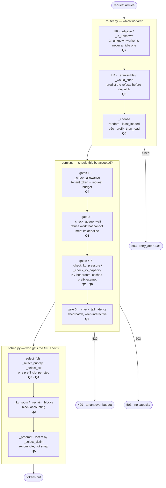

# mini-llm-serving-sim

A simulated LLM serving system — admission control, scheduling and routing — with
no GPU, no network and no model. Every "token" is an integer and every "KV block"
is a counter, so the whole thing runs in about a second and the policy decisions
are the only variable.

The four policy modules were extracted from a live vLLM gateway, unchanged. The
point of the simulator is to put them under load you can reproduce exactly and
measure what they actually do, rather than what the comments claim.

```bash
make setup && make test     # 304 tests
make part2                  # scheduler comparison: FCFS vs priority vs DRR
make part3                  # routing experiments -> results/ and plots/
```

Python 3.11+. The simulation itself is pure standard library; `pytest` and
`matplotlib` are only needed for the tests and the two plots.

---

## The request path

Each request goes **route → admit → schedule**. The router picks a worker, the
admission gate on that worker says yes or no, and the scheduler decides who gets
the GPU next. Nothing retries and nothing reserves capacity.



### The eight questions, and where each is answered

| # | Question | Where |
|---|---|---|
| Q1 | Where do I prevent accepting work that will time out? | `admit._check_queue_wait` (gate 3) — expected queue wait vs half of `req.deadline_s` |
| Q2 | Where do I protect KV memory? | `admit._check_kv_pressure` and `_check_kv_capacity` before entry; `sched._kv_room` and `_reclaim_blocks` after |
| Q3 | Where do I prioritise interactive traffic? | `admit._check_tail_latency` (gate 6) sheds batch under a blown tail; `sched._select_priority` orders the GPU; `_select_victim` refuses to evict upward |
| Q4 | Where do I stop one tenant monopolising? | `admit._check_allowance` (gates 1–2, 429) before entry; `sched._select_drr` shares the prefill slot after |
| Q5 | Where do I preempt a request? | `sched._preempt`, triggered by `_reclaim_blocks`, victim chosen by `_select_victim` |
| Q6 | Where do I exploit shared prefixes? | `router._prefix_then_load` picks the warm worker; `_cached_tokens` feeds admission gate 4 |
| Q7 | Where do I avoid sending work to a worker that has gone quiet? | `router._eligible` / `_is_unknown` (H6), with `_load_key` sorting an unknown view as maximally loaded behind it |
| Q8 | Where do I avoid bouncing a request around the fleet? | `router._admissible` / `_would_shed` (H4) — refuses once with `Shed(503, retry_after=2.0)` rather than letting the client shop around |

---

## Files

| Path | What it does |
|---|---|
| `admit.py` | Six admission gates in a fixed order, first refusal wins. Returns `(shed, code, retry_after)`. Says yes or no and nothing else — no reserving, no retrying, no routing. Fails closed on every missing signal. |
| `sched.py` | One `step()` is one GPU turn: validate, drop aborts, pick decoders, reserve them a token each, prefill exactly one prompt, preempt only if memory demands it. FCFS / priority / DRR. |
| `router.py` | `pick(req, workers)` returns a `WorkerView` or a `Shed`. Two safety rules (H6, H4) run before any of the four strategies, so a strategy has no error cases. |
| `state.py` | The `PendingRequest` shape shared by admission and routing, lifted from the gateway so the same `should_shed` runs against both. |
| `serve.py` | The harness: a simulated clock, per-worker queues, the admission bridge, metrics. This is what the experiments drive. |
| `experiments.py` | Runs Part 2 and T1/T2/T3, writes `results/*.json` + `*.csv` and the two plots. Re-runs Part 2 first and fails loudly if the published table has moved. |
| `traces/gen_mixed.py` | Part 2 workload generator — seeded, exact class proportions (interactive / batch / agents). |
| `traces/gen_router.py` | The three routing workloads: unique prefixes (T1), shared prefix (T2), stale telemetry (T3). |
| `tests/` | 304 tests. Ordering, chunked prefill, DRR fairness, block accounting, victim selection, all six admission gates against malformed input, H6 across five unknown shapes × four strategies. |
| `docs/` | The reasoning behind each module, gate by gate, including the limitations. |
| `REPORT.pdf` | The two-page write-up of the results. |

### Simulated hardware

Set in `serve.py`. Token budget 2,048/step, 32 decode slots, 8,192 KV blocks of
16 tokens. Step cost is `0.006 + prefill_tokens / 20,000` seconds — prefill work
steals decode throughput, which is the single most transferable result here.

**Capacity is ~6.15 req/s and the useful band is narrow.** Below ~6 req/s the
server absorbs everything and all three policies score identically; above ~8 the
admission gate sheds three quarters of the traffic and you are measuring
admission rather than scheduling. Part 2 runs at 7.

---

## What the experiments found

Full numbers and the reasoning are in [`REPORT.pdf`](REPORT.pdf) and
[`docs/part2-findings.md`](docs/part2-findings.md). The three results worth
knowing up front:

**DRR wastes the most decode work while preempting the least.** 524 wasted tokens
across 10 preemptions, against priority's 125 across 17 and FCFS's 158 across 114
— 52.4 tokens per preempt vs 7.4 and 1.4. Fairness is the cause: DRR lets a batch
request decode continuously until memory pressure evicts it, and preemption here
is recompute, so every generated token is thrown away. The policy that refuses to
starve anyone is the one that guarantees its victims have something to lose.

**On two workers, power-of-two-choices *is* least-loaded.** Drawing two from two
is the full scan. The p2c-vs-random result is real (8.4× better p99), but any
p2c-vs-least-loaded claim at N=2 measures the tie-break order and the RNG, so the
comparison is re-run at 4 and 8 workers.

**The stale-telemetry guard is wrong at N=2 and right at N=8.** H6 excludes a
worker whose telemetry has gone quiet. At two workers that takes half the fleet
offline and drives p99 to 23.35 s with 29.4% shed — much worse than the 8.17 s it
was preventing. At eight workers the same guard costs nothing and avoids a 65 s
p99. H6 costs one worker in N, so it costs more than the failure it prevents at
N=2 and almost nothing at N=8.

---

## Make targets

| Target | What it does |
|---|---|
| `make setup` | Create `.venv` and install `requirements.txt` |
| `make test` | Full suite |
| `make trace` | Regenerate `traces/mixed.jsonl` only |
| `make part2` | Regenerate the trace, run all three schedulers, print the comparison |
| `make part2-overload` | The 8 req/s congestion-collapse sensitivity case |
| `make router-traces` | Regenerate the three routing traces and the fleet-sweep copies |
| `make part3` | Part 2 + T1/T2/T3 into `results/` and `plots/` |
| `make all` | Tests, then everything |

Running one experiment by hand:

```bash
export PYTHONPATH=.
python serve.py --trace traces/t1_unique_prefix.jsonl --seconds 90 \
    --policy drr --workers 2 --strategy all
python serve.py --trace traces/t2_shared_prefix.jsonl --seconds 100 \
    --policy drr --workers 2 --strategy all --prefix-cache
python serve.py --trace traces/t3_stale.jsonl --seconds 120 \
    --policy drr --workers 2 --strategy all --stale-worker w1 --stale-lag 15
```

Useful `serve.py` flags: `--workers`, `--strategy` (or `all`), `--prefix-cache`,
`--stale-worker` / `--stale-lag` / `--stale-hidden`, `--seed`, `--json`.

Seeds are fixed at 7 throughout. The traces are inputs to a comparison, not a
sample, so the same seed every time is the point.

## Known gaps

Nothing reserves capacity, so two requests inside one scrape interval can both be
admitted against the same free blocks. `retry_after` is a placeholder and carries
no real estimate of when capacity returns. Priority is trusted as sent. Wasted
*prefill* is not counted, so true waste is larger than the metric reports. Each
module's `docs/` page lists its own limitations in full.
